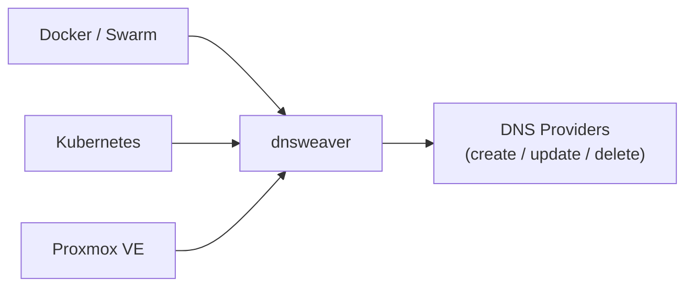

# dnsweaver

[](https://github.com/maxfield-allison/dnsweaver/releases)
[](https://hub.docker.com/r/maxamill/dnsweaver)
[](LICENSE)
[](go.mod)

**Automatic DNS record management for Docker, Kubernetes, and Proxmox VE workloads with multi-provider support.**

dnsweaver watches Docker events, Kubernetes resources, and Proxmox VE clusters to automatically create and delete DNS records. Unlike single-provider tools, dnsweaver supports **split-horizon DNS**, **multiple DNS providers** simultaneously, and works across **Docker**, **Kubernetes**, and **Proxmox** platforms.

📚 **[Full Documentation](https://maxfield-allison.github.io/dnsweaver/)**

## Features

- 🔀 **Multi-Provider Support** — Route different domains to different DNS providers
- 🌐 **Split-Horizon DNS** — Internal and external records from the same container labels
- 🐳 **Docker & Swarm** — Works with standalone Docker and Docker Swarm clusters
- ☸️ **Kubernetes Native** — Watches Ingress, IngressRoute, HTTPRoute, and Service resources via Helm or Kustomize
- 🖥️ **Proxmox VE** — Auto-creates A records for VMs (via QEMU guest agent) and LXC containers
- 🏗️ **Multi-Instance Safe** — Run multiple dnsweaver instances on the same DNS zone without conflicts
- 🔒 **Socket Proxy Compatible** — Connect via TCP to a Docker socket proxy for improved security
- 🏷️ **Traefik Integration** — Parses `traefik.http.routers.*.rule` labels to extract hostnames
- 🌐 **HTTP Source** — Polls Traefik-style dynamic config endpoints and extracts `http.routers.*.rule` hostnames
- 🚀 **Caddy Integration** — Parses `caddy` / `caddy_<n>` labels from [caddy-docker-proxy](https://github.com/lucaslorentz/caddy-docker-proxy)
- 🔧 **nginx-proxy Integration** — Parses `VIRTUAL_HOST` labels used by [jwilder/nginx-proxy](https://github.com/nginx-proxy/nginx-proxy)
- 📊 **Observable** — Prometheus metrics, health endpoints, structured logging
- 🔑 **Secrets Support** — Docker secrets and Kubernetes Secrets via `_FILE` suffix variables

## Supported Providers

| Provider | Record Types | Notes |
|----------|--------------|-------|
| [Technitium](https://maxfield-allison.github.io/dnsweaver/providers/technitium/) | A, AAAA, CNAME, SRV, TXT | Full-featured self-hosted DNS |
| [Cloudflare](https://maxfield-allison.github.io/dnsweaver/providers/cloudflare/) | A, AAAA, CNAME, SRV, TXT | With optional proxy support |
| [RFC 2136](https://maxfield-allison.github.io/dnsweaver/providers/rfc2136/) | A, AAAA, CNAME, SRV, TXT | BIND, Windows DNS, PowerDNS, Knot |
| [Pi-hole](https://maxfield-allison.github.io/dnsweaver/providers/pihole/) | A, CNAME | API or file mode |
| [AdGuard Home](https://maxfield-allison.github.io/dnsweaver/providers/adguard/) | A, AAAA, CNAME | DNS rewrite management |
| [dnsmasq](https://maxfield-allison.github.io/dnsweaver/providers/dnsmasq/) | A, CNAME | File-based configuration |
| [Webhook](https://maxfield-allison.github.io/dnsweaver/providers/webhook/) | Any | Custom integrations |

## Quick Start

### Installation

```bash
# Docker Hub
docker pull maxamill/dnsweaver:latest

# GitHub Container Registry
docker pull ghcr.io/maxfield-allison/dnsweaver:latest
```

### Basic Example

```yaml
services:
  dnsweaver:
    image: maxamill/dnsweaver:latest
    restart: unless-stopped
    environment:
      - DNSWEAVER_INSTANCES=internal-dns
      - DNSWEAVER_INTERNAL_DNS_TYPE=technitium
      - DNSWEAVER_INTERNAL_DNS_URL=http://dns.internal:5380
      - DNSWEAVER_INTERNAL_DNS_TOKEN_FILE=/run/secrets/technitium_token
      - DNSWEAVER_INTERNAL_DNS_ZONE=home.example.com
      - DNSWEAVER_INTERNAL_DNS_RECORD_TYPE=A
      - DNSWEAVER_INTERNAL_DNS_TARGET=192.0.2.100
      - DNSWEAVER_INTERNAL_DNS_DOMAINS=*.home.example.com
    volumes:
      - /var/run/docker.sock:/var/run/docker.sock:ro
    secrets:
      - technitium_token

secrets:
  technitium_token:
    external: true
```

### How It Works



1. A container starts with a Traefik label (or a Kubernetes Ingress/HTTPRoute is created):
   ```yaml
   labels:
     - "traefik.http.routers.myapp.rule=Host(`myapp.home.example.com`)"
   ```

2. dnsweaver extracts the hostname and matches it against configured provider domain patterns

3. The matching provider creates the DNS record:
   - **A record**: `myapp.home.example.com → 192.0.2.100`
   - **CNAME**: `myapp.example.com → proxy.example.com`

4. When the container stops (or the Kubernetes resource is deleted), the DNS record is automatically cleaned up

## Documentation

| Topic | Description |
|-------|-------------|
| [Getting Started](https://maxfield-allison.github.io/dnsweaver/getting-started/) | Installation and first configuration |
| [Configuration](https://maxfield-allison.github.io/dnsweaver/configuration/environment/) | Environment variables reference |
| [Providers](https://maxfield-allison.github.io/dnsweaver/providers/) | Provider-specific setup guides |
| [Sources](https://maxfield-allison.github.io/dnsweaver/sources/) | Docker, Kubernetes, Proxmox, Traefik file and HTTP sources |
| [Kubernetes](https://maxfield-allison.github.io/dnsweaver/deployment/kubernetes/) | Kubernetes deployment with Helm/Kustomize |
| [Proxmox VE](https://maxfield-allison.github.io/dnsweaver/sources/proxmox/) | Auto-DNS for VMs and LXC containers |
| [Split-Horizon DNS](https://maxfield-allison.github.io/dnsweaver/deployment/split-horizon/) | Internal + external records |
| [Docker Swarm](https://maxfield-allison.github.io/dnsweaver/deployment/swarm/) | Swarm deployment guide |
| [Observability](https://maxfield-allison.github.io/dnsweaver/observability/) | Metrics, logging, and health checks |
| [FAQ](https://maxfield-allison.github.io/dnsweaver/faq/) | Common questions and troubleshooting |

## Kubernetes Quick Start

Deploy dnsweaver to watch Kubernetes resources for DNS management:

```bash
# Using Kustomize
kubectl apply -k https://github.com/maxfield-allison/dnsweaver/deploy/kustomize/base

# Using Helm
helm install dnsweaver deploy/helm/dnsweaver/ \
  --namespace dnsweaver --create-namespace
```

dnsweaver automatically detects hostnames from Ingress, IngressRoute (Traefik), HTTPRoute (Gateway API), and Service resources. Use `dnsweaver.dev/*` annotations for per-resource overrides:

```yaml
apiVersion: networking.k8s.io/v1
kind: Ingress
metadata:
  name: my-app
  annotations:
    dnsweaver.dev/record-type: "A"
    dnsweaver.dev/target: "192.0.2.100"
spec:
  rules:
    - host: app.example.com
```

See the [Kubernetes deployment guide](https://maxfield-allison.github.io/dnsweaver/deployment/kubernetes/) for full configuration.

## Split-Horizon DNS Example

Manage internal and external DNS from the same container labels:

```yaml
environment:
  - DNSWEAVER_INSTANCES=internal,external

  # Internal: Technitium → private IP
  - DNSWEAVER_INTERNAL_TYPE=technitium
  - DNSWEAVER_INTERNAL_RECORD_TYPE=A
  - DNSWEAVER_INTERNAL_TARGET=192.0.2.100
  - DNSWEAVER_INTERNAL_DOMAINS=*.example.com

  # External: Cloudflare → tunnel CNAME
  - DNSWEAVER_EXTERNAL_TYPE=cloudflare
  - DNSWEAVER_EXTERNAL_RECORD_TYPE=CNAME
  - DNSWEAVER_EXTERNAL_TARGET=tunnel.example.com
  - DNSWEAVER_EXTERNAL_DOMAINS=*.example.com
```

With this configuration, when `app.example.com` starts:
- Internal DNS → `A` record → `192.0.2.100`
- External DNS → `CNAME` record → `tunnel.example.com`

## Contributing

Contributions are welcome! See [CONTRIBUTING](https://maxfield-allison.github.io/dnsweaver/contributing/) for guidelines.

## License

[MIT License](LICENSE)
